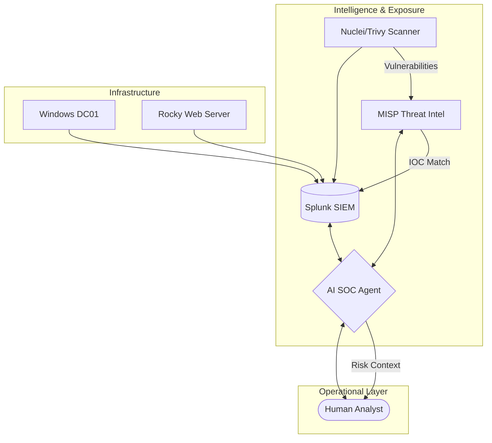

# Hayyan SOC — Threat-Informed AI Defense System 🛡️🤖

**Commercial-grade, closed-loop cybersecurity training and operations platform.**

Hayyan SOC (v3.0) transforms traditional reactive monitoring into a proactive, intelligence-driven defense system. Powered by **Google Gemini** and **LangGraph**, it integrates real-time telemetry with global threat intelligence and automated vulnerability exposure analysis.

---

## 🏛️ Architecture: The Feedback Triangle

Hayyan SOC operates on a continuous feedback loop between three core pillars:

1.  **Threat Intelligence (MISP)**: Real-time ingestion of malicious indicators (IPs, domains, hashes) from global feeds (CIRCL, URLhaus, Abuse.ch).
2.  **Vulnerability Exposure (Nuclei/Trivy)**: Automated daily scanning of the lab environment (Rocky Linux, DC01, Containers) to map the attack surface.
3.  **Live Telemetry (Splunk)**: Centralized logs from Windows AD (Sysmon/EventLogs), Linux Auditd, and Nginx web servers.



---

## 🚀 Key Features

### 🧠 Autonomous AI Investigator
- **ReAct Agent Architecture**: Chains multiple tools to investigate alerts end-to-end.
- **Resilient LLM Routing**: Primary (OpenRouter/DeepSeek) → Fallback (Groq/Llama) → Offline (Ollama/Qwen).
- **Audit Trail**: Every AI decision and tool call is logged to `ai_soc_audit` for full transparency.

### 🛡️ Threat-Informed Detection
- **Risk-Adjusted Alerting**: Alerts are automatically elevated if the target host has unpatched critical vulnerabilities (CVSS >= 9.0).
- **MISP Integration**: Automated lookup of every suspicious indicator against local and global threat intel.
- **Retrospective Hunting**: Daily "Hunt" searches that check if new MISP IOCs appeared in your logs over the last 7 days.

### 🔬 Integrated Scanner Pack
- **Nuclei**: Automated web and network service vulnerability scanning.
- **Trivy**: Deep filesystem and container image security auditing.
- **Systemd Orchestration**: Scheduled scans with normalized schema delivery via Splunk HEC.

---

## 🛠️ Tech Stack

- **AI Framework**: LangChain, LangGraph, Pydantic AI
- **LLMs**: Google Gemini 2.5 Flash, DeepSeek-V3, Llama 3.3 (70B), Qwen 3 (4B)
- **SIEM**: Splunk Enterprise (HEC + REST API)
- **Threat Intel**: MISP (Malware Information Sharing Platform)
- **Scanners**: ProjectDiscovery Nuclei, Aqua Security Trivy
- **Frontend**: Streamlit (Dashboard) + Tailwind/FastAPI (Chat)

---

## 🏁 Quick Start

### 1. Prerequisites
- Docker & Docker Compose
- Python 3.10+
- API Keys: Google Gemini (Primary) or OpenRouter (Secondary)

### 2. Deployment
```bash
# Clone and setup env
git clone https://github.com/VinsmokeD/Hayyan_Splunk.git
cd Hayyan_Splunk
python -m venv .venv
.venv\Scripts\Activate.ps1
pip install -r requirements.txt

# Start Infrastructure (Splunk + MISP)
docker compose -f docker-compose.splunk.yml up -d
docker compose -f docker-compose.misp.yml up -d

# Initialize AI & Threat Intel
bash scripts/misp_setup.sh
python scripts/misp_sync_splunk.py
```

### 3. Launch
```bash
# Terminal 1: AI API
python -m uvicorn soc_agents.api.app:app --host 0.0.0.0 --port 8500

# Terminal 2: Dashboard
streamlit run soc_agents/ui/streamlit_app.py
```

---

## 🚨 Active Detections & Dashboards

Access the **Threat-Informed Defense Dashboard** in Splunk to view:
- **Exposed + Attacked**: A crown-jewel view of hosts under active scan with high CVSS vulnerabilities.
- **IOC Match Timeline**: Real-time correlation of MISP intelligence hits.
- **AI Agent Audit**: Performance and quality metrics for autonomous investigations.

Quick links:
- Splunk UI: http://localhost:8080
- HayyanSOC Dashboard: http://localhost:8080/en-US/app/HayyanSOC/threat_dashboard
- Splunk REST API: https://localhost:8088
- Splunk HEC endpoint: http://localhost:8086/services/collector/event
- MISP UI: https://127.0.0.1:8443

Final hardening docs:
- docs/final/FINAL_CORRECTED_DOCS.md
- docs/final/IOC_DATA_FLOW_ONE_PAGER.md
- docs/final/DEMO_SCRIPT_3_MIN.md
- docs/final/API_KEY_ROTATION_STEP.md
- docs/final/READINESS_CHECKLIST.md

---

## 📜 Security & Trust
- **Sandboxed Execution**: All attack simulations target isolated Docker containers.
- **HITL (Human-in-the-Loop)**: AI is restricted from performing destructive actions without explicit analyst approval.
- **Privacy**: No telemetry or credentials leave the local lab environment.

---
**Hayyan SOC — Developed for Advanced Cybersecurity Training.**
